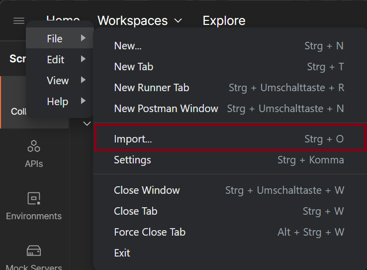
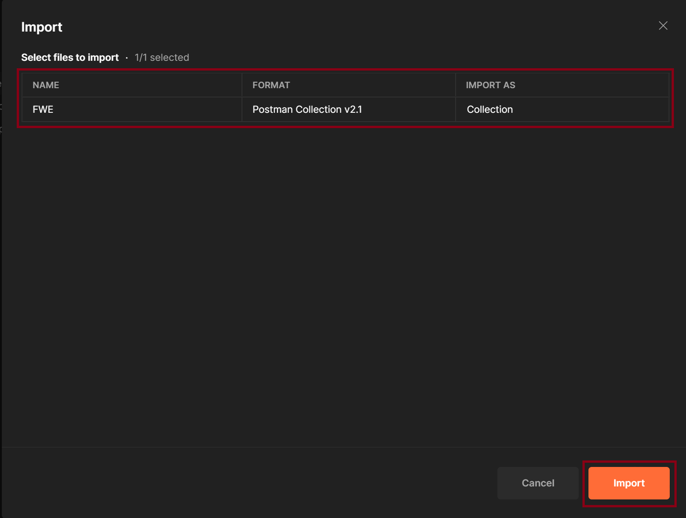

## Table Of Content

- [The Cookbook](#cookbook)
  - [Version](#version)
- [Installation](#installation)
    - [Docker Desktop](#docker-desktop)
    - [Node.js](#nodejs)
- [Startup](#startup)
  - [Troubleshooting](#troubleshooting)
- [Postman](#postman)
  - [Installation](#installation-1)
  - [Setup Collection](#setup-collection-optional)
- [Available Routes](#routes)
- [Freestyle Tasks](#freestyle-tasks)
  - [Task #1](#task-1)
  - [Task #2](#task-2)
- [Automated Testing](#automated-testing)
- [Database Schema](#database-schema)
- [Last words](#last-words)

# The Cookbook

Using the Create feature, you can add new recipes by inputting the necessary ingredients and step-by-step instructions.

The Read functionality allows you to access and view your entire collection of recipes and ingredients at any time. You can search for specific recipes and retrieve detailed information about each recipe, such as ingredients and steps.

The Update feature empowers you to make modifications to your existing recipes. You can refine the ingredients and edit the steps.

With the Delete capability, you can remove recipes or ingredients that are no longer relevant or needed. This helps you maintain a clutter-free and organized cookbook, focusing on the recipes that truly resonate with you.

Overall, a cookbook with CRUD functionality simplifies the process of recipe management, allowing you to create, explore, modify, and curate your culinary experiences in a user-friendly and efficient manner.

But a few prerequisites must be met before the service can be fully executed.

# Version

Current API Version: `v1`

# Installation

This document is for the latest version of the Cookbook API. Everything will be explained from scratch. 

### Docker Desktop

The latest Docker Desktop Version can be downloaded from [here](https://www.docker.com/products/docker-desktop/).

### Node.js

Node.js also includes the npm package which is also required. You can download the version you need from here:

* Recommended is the [LTS](https://nodejs.org/en/download) version.

# Environment Variables

**Important:** The webapi can only connect to the database, if the `.env` file exists in the `cookbook.webapi` folder.

The file must look like this:

```javascript
PORT=3500
DB_HOST="db"
DB_USER="user"
DB_PASSWORD="1234"
DB_DATABASE="cookbook"
```

**Note:** When running in a containerized environment, the `DB_HOST` will be the name of the container of your database (Default: `db`).

# Startup

After the installation guide, we can start the project. To do this make sure to execute the following command inside the project folder.

```bash
docker-compose up -d
```

This will start the containerized environment with all requirements. The api should work now and can be accessed via the [Routes](#routes).

## Troubleshooting

When running the containers in a linux environment and the following error shows up while the containers are trying to start:\
`ls: cannot open directory '/docker-entrypoint-initdb.d/': Permission denied`

Then you need to run the following command inside the `project` folder:

```bash
sudo chmod -R 777 PATH_TO_DATABASE_FOLDER
```

# Postman

Postman is only required if you want to use the given postman collection to access the backend api for HTTP requests. If you are skilled enough you can jump to the [Routes](#routes) directly and use `curl` or other tools for the HTTP requests.

## Installation

The latest postman version can be downloaded from [here](https://www.postman.com/downloads/). A registration is not required, the login can be skipped!

## Setup Collection (Optional)

After the installation of postman, we can insert the given postman collection which includes all possible routes with examples.

1. Click on the top left "Burger Menu" and select File -> Import.



2. Now Drag & Drop the given collection (JSON File) into the window of postman. You should see this then:



3. Click on "Import" and the Setup Guide for the Collection is done.

# Routes

**Note:** (Optional) To be able to use the routes, you may need to install [Postman](#postman). \
**Note:** Please note that `{{version}}` in the endpoints should be replaced with the actual API version you are using.

## Link Recipes/Ingredients
### Add Ingredients to Recipe

* Description: Adds ingredients to a recipe.
* Endpoint: `POST /api/{{version}}/recipes/ingredients`
* Request Body:
```
{
  "recipeId": 1,
  "ingredients": [
      {
          "ingredientId": 1,
          "amount": 3,
          "unit": "g"
      }
  ]
}
```

### Delete Ingredients from Recipe

* Description: Deletes ingredients from a recipe.
* Endpoint: `DELETE /api/{{version}}/recipes/ingredients`
* Request Body:
```
{
  "recipeId": 1,
  "ingredientIds": [1, 2]
}
```

### Get All Ingredients For Recipe

* Description: Retrieves all ingredients for a recipe.
* Endpoint: `GET /api/{{version}}/recipes/ingredients/1`
* Example Request:
```
GET /api/{{version}}/recipes/ingredients/1
```

### Delete Ingredient from Recipe

* Description: Deletes ingredients from a recipe. 
* Endpoint: `DELETE /api/{{version}}/recipes/ingredients` 
* Request Body:
```
{
  "recipeId": 1,
  "ingredientIds": [1, 2]
}
```

### Get All Ingredients For Recipe

* Description: Retrieves all ingredients for a recipe. 
* Endpoint: `GET /api/{{version}}/recipes/ingredients/1`
* Example Request:
```
GET /api/{{version}}/recipes/ingredients/1
```

## Search

### Search Recipe by Name

* Description: Searches for a recipe by name. 
* Endpoint: `GET /api/{{version}}/recipes/search?q=Schokoladenkuchen`
* Example Request:
```
GET /api/{{version}}/recipes/search?q=Schokoladenkuchen
```

## Daily

### Get Daily Recipes

* Description: Retrieves daily recipes. 
* Endpoint: `GET /api/{{version}}/recipes/daily` 
* Example Request:
```
GET /api/{{version}}/recipes/daily
```

## Cocktails

### Get Cocktails

* Description: Retrieves a list of cocktails.
* Endpoint: `GET /api/{{version}}/cocktails`
* Example Request:
```
GET /api/{{version}}/cocktails
```

## Recipes

### Create Recipe

* Description: Creates a new recipe. 
* Endpoint: `POST /api/{{version}}/recipes` 
* Request Body:
```
{
  "name": "Test",
  "description": "test",
  "picture": "testPicture",
  "steps": "test",
  "rating": 4,
  "kcal": 382
}
```

### Update Recipe

* Description: Updates an existing recipe. 
* Endpoint: `PUT /api/{{version}}/recipes`
* Request Body:
```
{
  "rid": 1,
  "update": {
      "name": "Hallo",
      "kcal": 100,
      "description": "test"
  }
}
```

### Delete Recipe

* Description: Deletes a recipe. 
* Endpoint: `DELETE /api/{{version}}/recipes`
* Request Body:
```
{
  "rid": 1
}
```

### Get Recipes

* Description: Retrieves all recipes. 
* Endpoint: `GET /api/{{version}}/recipes`
* Example Request:
```
GET /api/{{version}}/recipes
```

## Ingredients
### Create Ingredient

* Description: Creates a new ingredient. 
* Endpoint: `POST /api/{{version}}/ingredients`
* Request Body:
```
{
  "name": "Test",
  "description": "Test",
  "picture": "test"
}
```

### Update Ingredient

* Description: Updates an existing ingredient. 
* Endpoint: `PUT /api/{{version}}/ingredients`
* Request Body:
```
{
  "iid": 1,
  "update": {
      "name": "Test",
      "description": "test"
  }
}
```

### Delete Ingredient

* Description: Deletes an ingredient. 
* Endpoint: `DELETE /api/{{version}}/ingredients`
* Request Body:
```
{
  "iid": 1
}
```

### Get Ingredients

* Description: Retrieves all ingredients. 
* Endpoint: `GET /api/{{version}}/ingredients`
* Example Request:
```
GET /api/{{version}}/ingredients
```

### Get All Recipes for Ingredient

* Description: Retrieves all recipes that contain a specific ingredient. 
* Endpoint: `GET /api/{{version}}/recipes/ingredients/Hackfleisch`
* Example Request:
```
GET /api/{{version}}/recipes/ingredients/Hackfleisch
```

# Freestyle Tasks

## Task #1

If you're looking for random recipe ideas when you're unsure what to cook.
Daily Recipes has got you covered. With its vast collection of diverse and exciting recipes, you can discover new and delicious dishes to try.
Whether you're in the mood for a hearty meal, a quick and easy option, or something exotic. Daily Recipes can provide the inspiration you need for your next culinary adventure.

* Description: Retrieves daily recipes.
* Endpoint: `GET /api/{{version}}/recipes/daily`
* Example Request:
```
GET /api/{{version}}/recipes/daily
```

## Task #2

The Cocktail Library API is a valuable resource for cocktail enthusiasts, providing a vast collection of various cocktails.
It allows users to explore from classic favorites to unique creations.

* Description: Retrieves a list of cocktails.
* Endpoint: `GET /api/{{version}}/cocktails`
* Example Request:
```
GET /api/{{version}}/cocktails
```

# Automated Testing

To run the automated tests, you need to make sure that [Node.js](#nodejs) is installed correctly.\
Also make sure that the project dependencies are installed, which can be done with the following command inside the root folder of the webapi:

```bash
npm install
```

The installation of the dependencies may take some time.\
After the installation of the dependencies, you need to build the webapi by using:

```bash
npm run build
```

Now you should be able to start the webapi by:

```bash
npm run start
```

If the webapi starts listening, you can start the tests via:

```bash
npm run test
```

# Database Schema

## Table: INGREDIENT

This table stores information about individual ingredients.

| Column       | Type         | Description                    |
|--------------|--------------|--------------------------------|
| iid          | INT          | Unique identifier for ingredient (auto-increment) |
| name         | VARCHAR(255) | Name of the ingredient          |
| description  | VARCHAR(255) | Description of the ingredient   |
| picture      | VARCHAR(255) | URL or path to the ingredient's picture |

## Table: RECIPE

This table stores information about recipes.

| Column       | Type         | Description                    |
|--------------|--------------|--------------------------------|
| rid          | INT(11)      | Unique identifier for recipe (auto-increment) |
| name         | VARCHAR(255) | Name of the recipe              |
| description  | VARCHAR(255) | Description of the recipe       |
| steps        | LONGTEXT     | Detailed steps to prepare the recipe |
| picture      | VARCHAR(255) | URL or path to the recipe's picture |
| rating       | INT(11)      | Rating of the recipe (default: 0) |
| kcal         | INT(11)      | Calorie count of the recipe     |

## Table: RECIPE_CONTAINS_INGREDIENT

This table represents the many-to-many relationship between recipes and ingredients, indicating which ingredients are used in each recipe.

| Column  | Type    | Description                                         |
|---------|---------|-----------------------------------------------------|
| rid     | INT(11) | Identifier of the recipe (foreign key to recipes)    |
| iid     | INT(11) | Identifier of the ingredient (foreign key to ingredients) |
| amount  | INT(11) | Amount of the ingredient needed for the recipe       |
| unit    | VARCHAR(5) | Unit of measurement for the ingredient (e.g., grams, cups) |

# Last words

If all steps were followed correctly, you should be able to use the postman collection to access the backend API of the cookbook.
Also the whole website should work!

Happy Hacking!